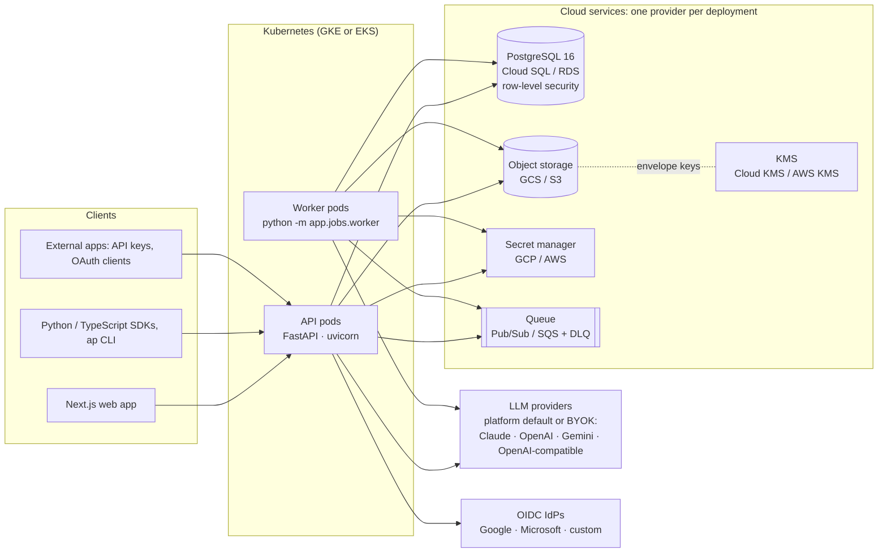
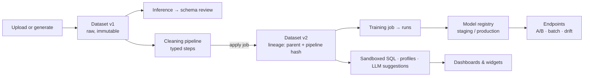

# Architecture

## Overview

- **One image, two processes.** The API and the job worker share one container image. The worker pulls job IDs from the queue; the database row is the source of truth for job status, progress and results.
- **Schedules.** Workers also tick the scheduler (`app/jobs/scheduler.py`, or standalone `python -m app.jobs.scheduler`), which submits due cron schedules as jobs. Each run is claimed with a conditional update of `next_run_at`, so every replica can tick without submitting a run twice.
- **The cloud is a configuration choice.** `AP_CLOUD_PROVIDER=local|gcp|aws` selects implementations of four interfaces in `app/cloud/base.py`: `ObjectStore`, `SecretStore`, `KeyManager` and `Queue`. No other module imports a cloud SDK. Adding a provider (for example Azure) means implementing those four interfaces plus a branch in `app/cloud/factory.py`. Terraform in `infra/terraform/{modules,envs}/{gcp,aws}` outputs exactly the `AP_*` environment variables the app reads.
- **Retention.** A daily CronJob (`python -m app.retention`) applies each organization's retention policy. Expired LLM bodies in the audit log are replaced by their hash commitment, and expired audit entries are cut from the oldest end with a stored anchor, so the chain still verifies.
- **Single-node analytics.** Decision D3 caps datasets at 1 GB, so DuckDB, pandas and scikit-learn run inside the API or worker process. There is no Spark.

## Tenancy and security

| Layer | Mechanism |
|-------|-----------|
| Identity | Email/password (argon2), OIDC SSO, TOTP MFA, JWT access tokens plus rotating single-use refresh tokens with reuse detection, API keys (hashed, scoped, IP-restricted), OAuth client credentials |
| Authorization | Tenant RBAC matrix (`app/auth/rbac.py`), project membership (`app/projects.py`), dashboard sharing roles |
| Data isolation | `tenant_id` on every row; Postgres row-level security keyed on `app.tenant_id` per session; object keys under `tenants/{id}/` |
| Encryption | Per-tenant data key: chunked AES-256-GCM with the object key as AAD, wrapped by the cloud KMS with the tenant bound as AAD/encryption context. Deleting the wrapped key crypto-shreds the tenant, backups included |
| Secrets | Cloud secret manager with tenant-scoped names; write-only via the API |
| Untrusted input | SELECT-only SQL (DuckDB parser), a DuckDB connection locked against file, network and extension access, typed SQL parameters, escaped filter literals, defusedxml, zip-bomb and path checks, SSRF guard for webhooks and connectors |
| LLM data handling | Data minimization levels L0–L3 (PII masked by default), data passed as delimited data rather than instructions, schema-validated outputs, generated SQL validated in the sandbox |
| Audit | Append-only, hash-chained per-tenant audit log (`/v1/tenant/audit/verify`) |

## Data lifecycle

## Module map (`backend/app`)

| Package | Responsibility |
|---------|---------------|
| `schema/` | Canonical schema model; JSON Schema, XSD, SQL DDL and natural-language parsers |
| `generation/` | Seeded, prefix-stable sample-data generator; exporters |
| `ingestion/` | Format and encoding detection, loading through DuckDB, schema inference |
| `profiling/` | Statistics, outliers, duplicates, correlations, quality score |
| `cleaning/` | Pipeline steps and the pipeline service (undo/redo, preview, templates, apply) |
| `analytics/` | SQL sandbox, LLM suggestions, saved and parameterized analytics |
| `training/` | Algorithm catalog, preprocessing, AutoML trainer, metrics, explainability, registry |
| `serving/` | Endpoints, traffic splits, online and batch inference, metrics, drift |
| `dashboards/` | Dashboard specs, widget data, sharing, export, embedding |
| `llm/` | Provider adapters, router (fallback, cache, metering, audit), tenant configuration |
| `jobs/` | Queue-backed job system and worker |
| `cloud/` | Provider-neutral storage, secrets, KMS and queue, plus per-tenant envelope encryption |
| `auth/` | Identity, RBAC, OIDC |
| `db/` | SQLAlchemy models and sessions (RLS on Postgres) |
| `connectors/` | Database and warehouse connectors (SSRF-guarded) |
| `streams.py` | Streaming ingestion: buffered micro-batches compacted into dataset versions |
| `scheduling/` | The allowlist of schedulable job types, and scheduled deliveries |
| `notify/`, `webhooks.py`, `inbound_hooks.py` | In-app, email and chat notifications; outgoing and incoming webhooks |
| `comments.py`, `projects.py`, `public_links.py` | Collaboration, project membership, public dashboard links |
| `retention.py` | Per-tenant retention policies and the daily sweep (SOC-PRV-002) |
| `api/` | FastAPI routers; `deps.py` wires `AppState` from settings |

## Scaling notes
- **API pods** are stateless. The in-process rate limiter and caches are per pod; a shared Redis can back the same interfaces when exact global limits are needed.
- **Workers** scale on queue depth. Training jobs are bounded by the tenant concurrency quota and by per-job time budgets.
- **Model artifacts** are loaded into a per-pod LRU cache. Endpoints warm up their models on deploy (API-010).
