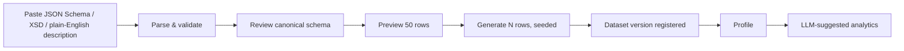
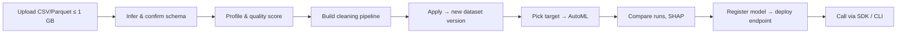

# Analytics Platform — Requirements Specification

**Version:** 1.2 · **Date:** September 27, 2026 · **Status:** Refined draft, awaiting stakeholder sign-off

> v1.2 cleans up v1.1: it fixes internal contradictions, re-tiers the P0 scope so an MVP can ship, adds acceptance criteria and missing security requirements, and lists the questions still open. The [Change Log](#15-change-log-v11--v12) at the end lists every material change.

---

## 1. Executive Summary

The Analytics Platform is an AI-assisted, multi-tenant SaaS product that takes users from raw data to deployed predictive models and live dashboards. It has **seven modules**:

| # | Module | One-liner |
|---|--------|-----------|
| 1 | Schema & Sample Data Engine | Turn schemas (JSON Schema / XSD / SQL DDL / natural language) into realistic sample datasets |
| 2 | Data Ingestion & Schema Inference | Upload data files and discover their schema automatically |
| 3 | Data Analysis & Cleaning | Profile, validate and clean data with a reproducible, non-destructive pipeline |
| 4 | AI-Assisted Analytics | Analytics suggested by an LLM, plus user-defined analytics (builder / NL / SQL) |
| 5 | Model Training Studio | Train, tune, evaluate and explain predictive models |
| 6 | Dashboard & Widget Builder | Drag-and-drop dashboards built from reusable widgets |
| 7 | Integration & API Gateway | Serve models and analytics over REST, SDKs and a CLI |

### 1.1 Confirmed Decisions

| # | Decision | Resolution | Consequences |
|---|----------|-----------|--------------|
| D1 | Deployment model | **SaaS, multi-tenant cloud** | Tenant isolation at the data, compute and API layers. No self-hosted or on-prem offering. |
| D2 | LLM strategy | **Provider-agnostic** | Every LLM call goes through the provider abstraction (§6.4). Tenants choose a provider and may bring their own keys. |
| D3 | Maximum data size | **1 GB per dataset** (and per uploaded file) | Single-node processing (DuckDB/Polars). **No Spark in any phase unless this decision is revisited.** |
| D4 | Compliance | **SOC 2 Type II** | Controls must be designed in from the architecture phase (§10.5). |

### 1.2 Decisions Proposed in v1.2 (need sign-off)

| # | Proposal | Rationale |
|---|----------|-----------|
| P1 | **Python (FastAPI) backend** for every service | The ML, profiling and explainability stack (pandas/Polars, scikit-learn, XGBoost, SHAP, Optuna) is Python. One backend language keeps hiring and code sharing simple. |
| P2 | **DuckDB as the analytical engine** | It fits D3: it runs in-process, reads CSV, Parquet and JSON natively, and is fast on datasets up to 1 GB. |
| P3 | **An in-house LLM adapter interface** (LiteLLM stays an option behind it) | Gives us control over logging, redaction and cost metering, and fewer third-party dependencies (SOC-CON-005). |
| P4 | **Postgres row-level security plus a per-tenant object-storage prefix and a per-tenant encryption key** | Satisfies MT-001 and enables cryptographic shredding (SOC-CON-004). |
| P5 | **Priority tiers map to phases** (see §13) | v1.1 had P0 items listed under Phase 2. Now P0 = MVP, P1 = Growth, P2 = Scale. |

---

## 2. Glossary

| Term | Definition |
|------|-----------|
| Tenant | A paying organisation. The unit of isolation, billing and configuration. |
| Project | A workspace inside a tenant that groups datasets, analytics, models and dashboards. |
| Schema | A structural definition of entities, fields, types, constraints and relationships, stored in the platform's **canonical schema model** whatever the input format was. |
| Dataset | A named collection of data within a project (one or more related tables). |
| Dataset Version | An immutable snapshot of a dataset. Uploads and applied cleaning pipelines each create a new version. |
| Sample Data | Synthetic data that conforms to a schema. |
| Data Profile | Per-column statistics plus quality findings for a dataset version. |
| Cleaning Pipeline | An ordered, replayable list of transformations applied to a dataset version. |
| Analytic | A saved query plus its visualization spec (chart type, encodings, parameters). |
| Experiment / Run | One training configuration (experiment) and one execution of it (run). |
| Explanatory Analytics | Analysis of *why* an outcome happens (feature importance, SHAP, partial dependence). |
| Predictive Analytics | Models that forecast outcomes (classification, regression, time series). |
| Widget | A self-contained, configurable dashboard component. |
| Endpoint | A versioned API surface that serves a model or an analytic. |
| BYOK | "Bring your own key": a tenant-supplied LLM provider API key. |

---

## 3. Module 1 — Schema & Sample Data Engine

### 3.1 Overview
Users supply a schema in one of several formats. The platform parses it into the canonical schema model, validates it and generates realistic sample data. The reverse flow (inferring a schema from data) is Module 2.

### 3.2 Functional Requirements

#### 3.2.1 Schema Input
| ID | Requirement | Priority |
|----|-------------|----------|
| SCH-001 | Accept JSON Schema (Draft 2020-12, 2019-09, 07, 06, 04). `$ref`/`$defs` resolution within the same document. | P0 |
| SCH-002 | Accept XML Schema (XSD). Supported subset: `complexType`, `sequence`/`all`, `element` with `minOccurs`/`maxOccurs`, `attribute`, built-in simple types, `restriction` facets (`enumeration`, `pattern`, `min/maxInclusive`, `min/maxLength`). Unsupported constructs are reported as warnings, not silently dropped. | P0 |
| SCH-003 | Accept natural-language schema descriptions (parsed via the LLM layer) | P0 |
| SCH-004 | Accept SQL DDL (`CREATE TABLE`, including `PRIMARY KEY`, `FOREIGN KEY`, `NOT NULL`, `UNIQUE`, `CHECK`) | P1 |
| SCH-005 | Accept Avro / Protobuf schemas | P2 |
| SCH-006 | Visual schema editor for creating and editing schemas manually | P1 |
| SCH-007 | Nested / hierarchical schemas (objects within objects, arrays of objects). Nested arrays of objects are normalized into child entities with a generated foreign key. | P0 |
| SCH-008 | Relationships between entities (one-to-one, one-to-many, many-to-many via a junction entity) | P0 |
| SCH-009 | Validate schemas and report errors with a location (line/column for text formats, JSON Pointer for JSON) | P0 |
| SCH-010 | Versioned schema history per project, with diffs between versions | P1 |
| SCH-011 | Export the canonical schema as JSON Schema *(new)* | P0 |

#### 3.2.2 Natural-Language Schema Parsing
| ID | Requirement | Priority |
|----|-------------|----------|
| NLP-001 | Convert free-form text into the canonical schema model via the LLM layer, using structured (JSON) output validated against the canonical model | P0 |
| NLP-002 | Show the inferred schema for review and correction before anything is generated | P0 |
| NLP-003 | Iterative refinement through follow-up prompts ("add a loyalty tier to customers") | P1 |
| NLP-004 | Infer data types, constraints and sample value ranges from context | P0 |
| NLP-005 | Domain vocabulary ("SSN" → masked string pattern and PII tag; "email" → email format) | P1 |
| NLP-006 | If the LLM output fails validation, retry once with the validation errors fed back, then surface the errors to the user *(new)* | P0 |

> **Example.** Input: *"I need a customer table with name, email, date of birth, and a list of orders. Each order has an order ID, product name, quantity, and total price."*
> Output: `customers` and `orders` entities with types `string`, `email`, `date`, `integer` and `decimal`, and a one-to-many relationship `orders.customer_id → customers.id`.

#### 3.2.3 Sample Data Generation
| ID | Requirement | Priority |
|----|-------------|----------|
| GEN-001 | Generate sample data that conforms to the validated schema | P0 |
| GEN-002 | User chooses the record count per root entity, **1 to 1,000,000** (the ceiling is the 1 GB output cap; see GEN-NFR-004) | P0 |
| GEN-003 | Domain-aware generators (names, emails, addresses, phone numbers, dates, currency, UUIDs), chosen from field name, format and semantic tag | P0 |
| GEN-004 | Respect constraints: unique, not-null/nullable rate, min/max, length, regex pattern (common subset), enum | P0 |
| GEN-005 | Maintain referential integrity across related entities (every FK value exists in the parent) | P0 |
| GEN-006 | Distribution profiles per numeric field: uniform (default), normal, skewed (log-normal), custom weights | P1 |
| GEN-007 | Seeded generation: the same schema, seed and count produce byte-identical output | **P0** *(was P1; needed to test GEN-010 and to reproduce bugs)* |
| GEN-008 | Export as CSV, JSON, JSON Lines, Parquet and SQL INSERT | P0 |
| GEN-008a | Export as XML | P1 *(split out of GEN-008)* |
| GEN-009 | Inject anomalies and edge cases at a configurable rate | P2 |
| GEN-010 | Preview the first 50 rows per entity before full generation | P0 |

### 3.3 Non-Functional Requirements
| ID | Requirement |
|----|-------------|
| SCH-NFR-001 | Structured schema parsing (JSON/XSD/DDL) completes in ≤ 5 s for schemas with ≤ 500 fields |
| SCH-NFR-002 | Generating 100K records (≤ 50 fields) completes in ≤ 30 s |
| SCH-NFR-003 | Natural-language parsing takes ≤ 10 s p95 per prompt, excluding provider outages |
| SCH-NFR-004 | Refuse generation up front when the estimated output exceeds 1 GB, and tell the user the maximum feasible record count |
| SCH-NFR-005 | Generation above 100K records runs as an async job (MT-003) |

---

## 4. Module 2 — Data Ingestion & Schema Inference

### 4.1 Overview
Users upload data files. The platform detects the format, infers the schema and registers an immutable dataset version for downstream work.

### 4.2 Functional Requirements

#### 4.2.1 File Upload
| ID | Requirement | Priority |
|----|-------------|----------|
| ING-001 | Upload through drag-and-drop and a file picker | P0 |
| ING-002 | Upload through the API (multipart, plus resumable uploads per ING-NFR-001) | P0 |
| ING-003 | Formats: CSV, TSV, JSON (array of objects), JSON Lines, Parquet, Excel (.xlsx) | P0 |
| ING-003a | Formats: legacy Excel (.xls), Avro, ORC, XML | P1 *(split out of ING-003)* |
| ING-004 | Multi-file (batch) upload with per-file progress | P0 |
| ING-005 | Files up to 1 GB each; a dataset (all its files) up to 1 GB after decompression | P0 |
| ING-006 | Compressed files (.gz, .zip, .tar.gz), extracted automatically. The 1 GB limit applies to the uncompressed size; reject zip bombs (compression ratio > 100:1) | P1 |
| ING-007 | External sources: S3, GCS, Azure Blob, SFTP, JDBC/ODBC (one-off pull and scheduled pull) | P1 |
| ING-008 | Streaming ingestion (Kafka, Pub/Sub, webhooks) into an append-only dataset, still capped at 1 GB | P2 |
| ING-009 | Integrity checks: SHA-256 checksum (client-supplied checksum verified when present) and character-encoding detection | P0 |
| ING-010 | Store raw files immutably with metadata (upload time, user, SHA-256, size, detected format and encoding) | P0 |

#### 4.2.2 Schema Inference
| ID | Requirement | Priority |
|----|-------------|----------|
| INF-001 | Infer column names, types and nullability | P0 |
| INF-002 | Detect date/time formats and normalize them to ISO 8601 | P0 |
| INF-003 | Classify columns as categorical, continuous, identifier, free text or datetime | P0 |
| INF-004 | Detect primary-key candidates and unique columns | P1 |
| INF-005 | Detect foreign-key relationships across files (name similarity plus value containment ≥ 95%) | P1 |
| INF-006 | Show the inferred schema for review and editing before confirming | P0 |
| INF-007 | Schema evolution: detect added, removed or retyped columns when new files arrive for an existing dataset | P1 |
| INF-008 | Schema diff report on re-upload | P2 |
| INF-009 | Semantic tagging during inference: flag likely PII columns (email, phone, SSN, credit card, IP, name) — feeds SEC-004 and LLM-NFR-004 *(new)* | P0 |

### 4.3 Non-Functional Requirements
| ID | Requirement |
|----|-------------|
| ING-NFR-001 | Resumable uploads for files > 100 MB (tus protocol or signed multipart uploads to object storage) |
| ING-NFR-002 | **Preliminary** schema inference, from a sample (first 10K rows plus a 50K-row reservoir sample), completes in ≤ 10 s for files ≤ 1 GB. Full-file type validation then runs asynchronously and reports rows that break the inferred types. *(v1.1 asked for full inference on 1 GB in 10 s, which is not realistic for text formats.)* |
| ING-NFR-003 | 50 concurrent uploads per region with no degradation in p95 upload throughput |
| ING-NFR-004 | Reject uploads over 1 GB **before transfer** (declared size) and **during transfer** (byte count), with a clear message and guidance |
| ING-NFR-005 | Upload progress with an estimated time remaining |

---

## 5. Module 3 — Data Analysis & Cleaning

### 5.1 Overview
Automated profiling and quality assessment, plus automated and manual cleaning, recorded as a reproducible pipeline.

### 5.2 Functional Requirements

#### 5.2.1 Data Profiling & Analysis
| ID | Requirement | Priority |
|----|-------------|----------|
| ANA-001 | Profile report for every dataset version (dataset-level and per-column) | P0 |
| ANA-002 | Statistics: count, null count/%, distinct count, min, max, mean, median, std dev, P25/P50/P75/P99; top-k values for categoricals; string length stats | P0 |
| ANA-003 | Distributions: histograms and box plots | P0 |
| ANA-004 | Outlier flags via IQR and Z-score (thresholds configurable) | P0 |
| ANA-004a | Outlier flags via Isolation Forest | P1 *(split out)* |
| ANA-005 | Exact duplicate-row detection | P0 |
| ANA-005a | Near-duplicate (fuzzy) detection | P1 *(split out)* |
| ANA-006 | Correlation matrix across numeric columns (Pearson; Spearman optional) | P0 |
| ANA-007 | Type-mismatch detection (e.g. numbers or dates stored as strings, with the share of values that parse) | P0 |
| ANA-008 | Missing-value pattern analysis (MCAR/MAR/MNAR heuristics, labelled as heuristics) | P1 |
| ANA-009 | Data quality score (0–100) from completeness, uniqueness, validity and consistency, with the formula documented and shown | **P0** *(was P1; needed as the MVP health signal)* |
| ANA-010 | Column annotations (PII, sensitive, derived, target, ID) | P1 |

#### 5.2.2 Data Cleaning
| ID | Requirement | Priority |
|----|-------------|----------|
| CLN-001 | Missing values: drop rows or columns; fill with mean, median, mode or a constant; forward/backward fill; linear interpolation | P0 |
| CLN-002 | Outliers: remove, cap/floor (winsorize), or flag only | P0 |
| CLN-003 | Exact deduplication (optionally on a subset of key columns) | P0 |
| CLN-003a | Fuzzy deduplication with a configurable similarity threshold | P1 *(split out)* |
| CLN-004 | Type conversion, with a per-operation strategy for failed casts (null, drop row, or fail) | P0 |
| CLN-005 | String normalization: trim, change case, regex find/replace | P0 |
| CLN-006 | Normalization of mixed date formats | P0 |
| CLN-007 | Column operations: rename, reorder, drop, merge, split, and derived columns from an expression | P0 |
| CLN-008 | Row filtering by conditional expression | P0 |
| CLN-009 | Character-encoding conversion | P1 |
| CLN-010 | PII masking and redaction (hash, partial mask, tokenize, drop) for columns flagged by INF-009 | **P0** *(was P1; this conflicted with SEC-004 at P0)* |

> **Expression language.** CLN-007, CLN-008 and USR-004 share **one** sandboxed expression language: a safe SQL-expression subset evaluated by DuckDB, with no function calls outside an allowlist.

#### 5.2.3 Cleaning Pipeline & Audit Trail
| ID | Requirement | Priority |
|----|-------------|----------|
| PIP-001 | Every cleaning operation is recorded as a reproducible pipeline (an ordered, typed JSON list of steps) | P0 |
| PIP-002 | Undo/redo while editing | P0 |
| PIP-003 | Preview a step's effect before applying it | P0 |
| PIP-004 | Export and import pipelines as templates, and apply one to another dataset whose schema is compatible | P1 |
| PIP-005 | Before/after statistics for each step | P0 |
| PIP-006 | Audit log of every transformation with timestamp and user (written to the audit log in AUTH-005) | P0 |
| PIP-007 | Applying a pipeline creates a new dataset version with lineage (parent version plus pipeline hash) *(new)* | P0 |

### 5.3 Non-Functional Requirements
| ID | Requirement |
|----|-------------|
| ANA-NFR-001 | Profiling ≤ 1M rows × 50 columns completes in ≤ 60 s |
| ANA-NFR-002 | Cleaning is non-destructive: raw files and earlier versions are never modified |
| ANA-NFR-003 | Cleaning previews render in ≤ 3 s. Previews run on a ≤ 100K-row sample; the full apply runs as a job. |

---

## 6. Module 4 — AI-Assisted Analytics

### 6.1 Overview
The LLM suggests analytics suited to the dataset, and power users can define their own. Every analytic, whatever its source, ends up as the same object: a **validated read-only SQL query plus a chart spec**.

### 6.2 Functional Requirements

#### 6.2.1 LLM-Suggested Analytics
| ID | Requirement | Priority |
|----|-------------|----------|
| LLM-001 | Suggest analytics from the schema, the profile and (subject to LLM-NFR-004) sample rows | P0 |
| LLM-002 | Each suggestion includes chart type, columns, aggregation, grouping, and a plain-English rationale | P0 |
| LLM-003 | Categorize suggestions as descriptive, diagnostic, predictive or prescriptive | P1 |
| LLM-004 | Rank suggestions by estimated value | P1 |
| LLM-005 | Accept, modify or reject each suggestion | P0 |
| LLM-006 | Conversational refinement ("break this down by region", "compare Q1 vs Q2") | P0 |
| LLM-007 | Generate the SQL behind each suggestion and show it to the user | **P0** *(was P1; a suggestion can't be run without it)* |
| LLM-008 | Multi-dataset analytics (suggested joins) | P2 |
| LLM-009 | Personalize suggestions from past interactions (per tenant only; never shared across tenants) | P2 |

#### 6.2.2 User-Defined Analytics
| ID | Requirement | Priority |
|----|-------------|----------|
| USR-001 | Query builder UI (drag columns, filters, aggregations) | P0 |
| USR-002 | Define analytics in natural language | P0 |
| USR-003 | SQL editor with syntax highlighting and schema-aware autocomplete (runs under SEC-009) | P0 |
| USR-004 | Formula language for calculated metrics (the shared expression language, §5.2.2) | P1 |
| USR-005 | Save analytics as reusable templates | P0 |
| USR-006 | Parameterized analytics (date range, filters as inputs) | P1 |
| USR-007 | Scheduled analytics with email/Slack notifications | P2 |

#### 6.2.3 Visualization & Output
| ID | Requirement | Priority |
|----|-------------|----------|
| VIZ-001 | Core chart types: bar, line, area, scatter, pie/donut, heatmap, histogram, box plot | P0 |
| VIZ-001a | Extended chart types: treemap, funnel, gauge, Sankey, waterfall | P1 *(split out)* |
| VIZ-001b | Geo-map | P2 *(split out; needs geocoding)* |
| VIZ-002 | Interactivity: tooltips, click to drill down, zoom, pan | P0 |
| VIZ-003 | Cross-filtering across charts | P1 |
| VIZ-004 | Export charts as PNG and SVG | P0 |
| VIZ-004a | Export charts as PDF | P1 |
| VIZ-005 | Export the underlying data as CSV, JSON or Excel | P0 |
| VIZ-006 | Auto-refreshing charts for streaming data | P2 |

### 6.3 Non-Functional Requirements
| ID | Requirement |
|----|-------------|
| LLM-NFR-001 | Suggestions return in ≤ 15 s p95; results stream progressively where the provider supports it |
| LLM-NFR-002 | Pluggable LLM backends via the provider abstraction (§6.4) |
| LLM-NFR-003 | Every LLM interaction is logged for audit: tenant, user, provider, model, prompt-template ID and version, token counts, latency, outcome. **Prompt and response bodies are kept under the tenant's retention policy**, and PII is redacted before logging. |
| LLM-NFR-004 | **Data minimization.** Tenant-configurable level, default **L2**: **L0** schema only · **L1** + aggregated profile · **L2** + up to 20 sample rows with PII-tagged columns masked · **L3** + unmasked sample rows (explicit admin opt-in, recorded in the audit log). Raw full datasets are never sent to an LLM. |
| LLM-NFR-005 | Automatic fallback to the next provider in the tenant's chain on provider errors, timeouts or refusals (Phase 2, with LPA-005) |
| LLM-NFR-006 | Per-tenant provider selection and BYOK (see LPA-004) |
| LLM-NFR-007 | **Prompt-injection and output safety** *(new)*: data values are passed as clearly delimited data, never as instructions. LLM-generated SQL is parsed, restricted to one read-only `SELECT`, checked against the dataset's own tables, and run under SEC-009 limits. LLM output is never executed as code. |

### 6.4 LLM Provider Abstraction Layer

> **No module may call an LLM provider's API directly.** Every call goes through the `LLMRouter`.

| ID | Requirement | Priority |
|----|-------------|----------|
| LPA-001 | Provider interface with standard request/response contracts: `complete(prompt) → text` and `complete_json(prompt, schema) → validated object` | P0 |
| LPA-002 | Built-in adapters: **OpenAI, Anthropic Claude and Google Gemini** | P0 |
| LPA-002a | Native adapters for Meta Llama and Mistral hosted APIs. *(Until then, these are reachable through LPA-003, since their common hosts expose OpenAI-compatible APIs.)* | P1 |
| LPA-003 | Custom or self-hosted endpoints via an **OpenAI-compatible** base URL plus API key (covers vLLM, Ollama, Together, Mistral, Azure OpenAI) | P0 |
| LPA-004 | Per-tenant provider configuration and BYOK; keys stored in the secrets manager (SEC-005), never in the database or logs | P0 |
| LPA-005 | Ordered fallback chain per tenant | P1 |
| LPA-006 | Provider health monitoring (latency, error rate per provider) | P1 |
| LPA-007 | Token-usage tracking and cost estimation per tenant, per provider and per task | P0 |
| LPA-008 | Central, versioned prompt templates, with provider-specific variants | P1 |
| LPA-009 | Model choice per task (e.g. a fast model for autocomplete, a strong model for analytics) | P1 |
| LPA-010 | Response caching keyed on tenant, provider, model and prompt hash (tenant-scoped, never shared across tenants) | P1 |
| LPA-011 | Platform-default provider for tenants without BYOK, with a monthly token allowance *(new; depends on OQ-3)* | P0 |

---

## 7. Module 5 — Model Training Studio

### 7.1 Overview
Train, tune, evaluate and explain models on tabular data. Built for data scientists, but usable by analysts through sensible defaults and AutoML.

### 7.2 Functional Requirements

#### 7.2.1 Problem Definition
| ID | Requirement | Priority |
|----|-------------|----------|
| MDL-001 | Choose the target and feature columns | P0 |
| MDL-002 | Detect the problem type automatically: binary classification, multi-class classification, regression | P0 |
| MDL-002a | Also detect time-series forecasting and clustering | P1 *(split out; their algorithms are P1)* |
| MDL-002b | Also detect anomaly detection | P2 *(split out; its algorithms are P2)* |
| MDL-003 | Override the detected problem type | P0 |
| MDL-004 | Train/validation/test split (percentage, time-based, stratified) | P0 |
| MDL-005 | Cross-validation (k-fold, stratified k-fold, time-series split) | P0 |
| MDL-006 | Target-leakage warnings (features that correlate almost perfectly with the target, or that are post-outcome timestamps) *(new)* | P1 |

#### 7.2.2 Algorithms
| ID | Requirement | Priority |
|----|-------------|----------|
| TRN-001 | Linear: Linear Regression, Logistic Regression, Ridge, Lasso, Elastic Net | P0 |
| TRN-002 | Trees: Decision Tree, Random Forest, XGBoost, LightGBM | P0 |
| TRN-002a | CatBoost | P1 |
| TRN-003 | SVM (linear, RBF, polynomial) | P1 |
| TRN-004 | Neural networks: MLP | P1 |
| TRN-004a | RNN/LSTM, tabular transformers | P2 *(split out; needs a GPU, CFG-005)* |
| TRN-005 | Ensembles: bagging, boosting, stacking, voting | P1 |
| TRN-006 | Clustering: K-Means, DBSCAN, hierarchical, GMM | P1 |
| TRN-007 | Time series: ARIMA/SARIMA, Prophet, exponential smoothing | P1 |
| TRN-007a | N-BEATS | P2 |
| TRN-008 | Anomaly detection: Isolation Forest, One-Class SVM, autoencoders | P2 |
| TRN-009 | AutoML: model selection plus hyperparameter search (random, grid, Bayesian/TPE via Optuna) within a time budget | P0 |
| TRN-010 | Upload custom models (scikit-learn, PyTorch, TensorFlow), **ONNX or skops formats only; never arbitrary pickle** (SEC-010) | P2 |

#### 7.2.3 Feature Engineering
| ID | Requirement | Priority |
|----|-------------|----------|
| FE-001 | Automatic features: interactions, polynomial terms, date parts | P1 |
| FE-002 | Encoding: one-hot, label, target, ordinal | P0 |
| FE-003 | Scaling: standard, min-max, robust, log | P0 |
| FE-004 | Feature selection: correlation, mutual information, RFE, L1 | P0 |
| FE-005 | Dimensionality reduction: PCA | P1 |
| FE-005a | t-SNE, UMAP (for visualization only) | P2 |
| FE-006 | Text features: TF-IDF, embeddings | P2 |
| FE-007 | Custom Python transformations, **run under SEC-009** | P1 |

#### 7.2.4 Training Configuration
| ID | Requirement | Priority |
|----|-------------|----------|
| CFG-001 | Expose hyperparameters with sensible defaults | P0 |
| CFG-002 | Built-in documentation and tooltips for every hyperparameter | P0 |
| CFG-003 | Tuning with a configurable search space, budget and strategy | P0 |
| CFG-004 | Constraints: maximum training time, maximum memory (enforced by the job container), early stopping | P0 |
| CFG-005 | GPU / distributed training | P2 |
| CFG-006 | Class-imbalance handling: class weights, SMOTE, under/over-sampling | P0 |
| CFG-007 | Save and load configurations as templates | P1 |

#### 7.2.5 Experiment Tracking & Evaluation
| ID | Requirement | Priority |
|----|-------------|----------|
| EXP-001 | Track every run: parameters, metrics, duration, code version and dataset-version ID | P0 |
| EXP-002 | Classification metrics: accuracy, precision, recall, F1, ROC-AUC, PR-AUC, confusion matrix | P0 |
| EXP-003 | Regression metrics: MAE, MSE, RMSE, R², adjusted R², MAPE | P0 |
| EXP-004 | Time-series metrics: MASE, sMAPE, interval coverage | P1 |
| EXP-005 | Clustering metrics: silhouette, Calinski-Harabasz, Davies-Bouldin | P1 |
| EXP-006 | Plots: learning curves, ROC, PR, calibration, residuals | P0 |
| EXP-007 | Side-by-side run comparison | P0 |
| EXP-008 | Model registry with versions and stage tags (staging, production, archived) and rollback | P0 |

#### 7.2.6 Explainability *(IDs renamed from `EXP-E-*` to `XAI-*` to avoid clashing with `EXP-*`)*
| ID | Requirement | Priority |
|----|-------------|----------|
| XAI-001 | Global: feature importance, permutation importance, partial dependence plots | P0 |
| XAI-001a | Accumulated local effects (ALE) | P1 |
| XAI-002 | Local: SHAP values (waterfall, beeswarm) | P0 |
| XAI-002a | LIME, SHAP force plots | P1 |
| XAI-003 | What-if analysis | P1 |
| XAI-004 | Fairness analysis across protected attributes | P2 |
| XAI-005 | Plain-English model explanations via the LLM layer | P1 |

### 7.3 Non-Functional Requirements
| ID | Requirement |
|----|-------------|
| MDL-NFR-001 | Interrupted training is recoverable. AutoML resumes from completed trials; single fits restart automatically (at most 2 retries). |
| MDL-NFR-002 | Concurrent experiments, limited by tenant quota (MT-006) |
| MDL-NFR-003 | Live progress (trial or epoch, current best metric) streamed to the UI |
| MDL-NFR-004 | Artifacts stored in a native, safe format (skops/joblib for platform-trained models only). ONNX export is P1. PMML and SavedModel are P2. |
| MDL-NFR-005 | Artifacts live in a versioned model registry |

---

## 8. Module 6 — Dashboard & Widget Builder

### 8.1 Overview
Drag-and-drop dashboards made of configurable widgets that are bound to analytics and model outputs.

### 8.2 Functional Requirements

#### 8.2.1 Dashboard Management
| ID | Requirement | Priority |
|----|-------------|----------|
| DSH-001 | Create, clone, rename, archive and delete dashboards | P0 |
| DSH-002 | Drag-and-drop responsive grid layout | P0 |
| DSH-003 | Multiple pages or tabs per dashboard | P0 |
| DSH-004 | Global filters across widgets | P0 |
| DSH-005 | Global date-range control | P0 |
| DSH-006 | Auto-refresh (30 s to 24 h; 5 s only for streaming sources, P2) | P1 |
| DSH-007 | Full-screen / presentation mode | P1 |
| DSH-008 | Dark mode and custom themes | P1 |
| DSH-009 | Export a dashboard as PDF or PNG | P0 |
| DSH-009a | Export a dashboard as interactive HTML | P1 |
| DSH-010 | Dashboard templates | P1 |

#### 8.2.2 Widget Library
| ID | Requirement | Priority |
|----|-------------|----------|
| WDG-001 | Chart widgets (every chart type available in the current phase, per VIZ-001) | P0 |
| WDG-002 | KPI card: value, trend, sparkline, target comparison | P0 |
| WDG-003 | Data table: sort, filter, paginate | P0 |
| WDG-003a | Inline editing in data tables (writes create a new dataset version) | P2 |
| WDG-004 | Text / Markdown widget (sanitized) | P0 |
| WDG-005 | Image / media widget | P1 |
| WDG-006 | Filter widgets: dropdown, multi-select, slider, date picker | P0 |
| WDG-007 | Model prediction widget: input form → inference → prediction plus explanation | P1 |
| WDG-008 | Threshold / alert widget (red, amber, green) | P1 |
| WDG-009 | Embedded iframe widget (allowlisted domains) | P2 |
| WDG-010 | Custom HTML/JS widget (sandboxed iframe on a separate origin) | P2 |

#### 8.2.3 Widget Configuration
| ID | Requirement | Priority |
|----|-------------|----------|
| WCFG-001 | Configure each widget on its own (data source, fields, aggregation, colors, title, size) | P0 |
| WCFG-002 | Cross-widget linking | P1 |
| WCFG-003 | Conditional formatting | P0 |
| WCFG-004 | Drill-down paths | P1 |
| WCFG-005 | Per-widget caching with a TTL | P1 |

#### 8.2.4 Sharing & Collaboration
| ID | Requirement | Priority |
|----|-------------|----------|
| SHR-001 | Share inside the tenant (view or edit) | P0 |
| SHR-001a | Public view-only links (token-based, expiring, revocable, tenant admin can disable) | P1 |
| SHR-002 | Dashboard roles: owner, editor, viewer | P0 |
| SHR-003 | Embed through a signed embed token | P1 |
| SHR-004 | Scheduled email/Slack snapshots | P2 |
| SHR-005 | Comments and annotations | P2 |

### 8.3 Non-Functional Requirements
| ID | Requirement |
|----|-------------|
| DSH-NFR-001 | Load in ≤ 3 s p95 for ≤ 20 widgets when widget caches are warm |
| DSH-NFR-002 | Lazy-render widgets that are off-screen |
| DSH-NFR-003 | Responsive layout at desktop, tablet and mobile widths |
| DSH-NFR-004 | 100+ concurrent viewers per dashboard |
| DSH-NFR-005 | WCAG 2.1 AA for the dashboard viewer *(new)* |

---

## 9. Module 7 — Integration & API Gateway

### 9.1 Overview
Serve trained models and analytics to external applications.

### 9.2 Functional Requirements

#### 9.2.1 Model Serving & Deployment
| ID | Requirement | Priority |
|----|-------------|----------|
| API-001 | One-click deployment from the model registry to an endpoint | P0 |
| API-002 | REST inference (JSON), with the input schema enforced | P0 |
| API-003 | GraphQL | P1 |
| API-004 | gRPC | P2 |
| API-005 | Batch prediction (file or array → async job → result file) | P0 |
| API-006 | Streaming inference (WebSocket / SSE) | P2 |
| API-007 | Auto-generated OpenAPI documentation per endpoint | P0 |
| API-008 | A/B traffic split between model versions | P1 |
| API-009 | Canary rollout | P2 |
| API-010 | Warm-up / minimum replicas | P1 |
| API-011 | Prediction logging and drift monitoring (input drift, prediction drift) *(new)* | P1 |

#### 9.2.2 API Management
| ID | Requirement | Priority |
|----|-------------|----------|
| MGT-001 | API keys: generate, rotate, revoke. Keys are hashed at rest and shown only once. | P0 |
| MGT-002 | Rate limits per key and per tenant | P0 |
| MGT-003 | Concurrent API versions (v1, v2) | P0 |
| MGT-004 | Authentication: API key and JWT (issued by the platform IdP) | P0 |
| MGT-004a | OAuth 2.0 client-credentials flow | P1 |
| MGT-005 | Usage analytics: request count, p50/p95/p99 latency, error rate | P0 |
| MGT-006 | Request/response logging with PII redaction (off by default for bodies) | P0 |
| MGT-007 | IP allowlist / denylist | P1 |
| MGT-008 | CORS configuration | P0 |

#### 9.2.3 SDKs & CLI
| ID | Requirement | Priority |
|----|-------------|----------|
| SDK-001 | TypeScript SDK (generated from OpenAPI) | P0 |
| SDK-002 | Python SDK (generated from OpenAPI) | P0 |
| SDK-003 | Swift SDK | P1 |
| SDK-004 | Kotlin SDK | P1 |
| SDK-005 | Dart/Flutter SDK | P2 |
| SDK-006 | CLI (built on the Python SDK) | P0 |
| SDK-007 | Type-safe request/response models | P0 |
| SDK-008 | Built-in auth, retries with backoff, typed errors | P0 |

#### 9.2.4 Webhooks
| ID | Requirement | Priority |
|----|-------------|----------|
| WHK-001 | Outgoing webhooks, HMAC-signed, retried with backoff | P1 |
| WHK-002 | Incoming webhooks (trigger inference or ingestion) | P1 |
| WHK-003 | Webhook management UI with delivery history and redelivery | P1 |

### 9.3 Non-Functional Requirements
| ID | Requirement |
|----|-------------|
| API-NFR-001 | Single-record inference ≤ 100 ms p95 server-side on a **warm** endpoint, for models in the platform's standard families |
| API-NFR-002 | 99.9% monthly availability for the inference API (see SOC-AVL-001) |
| API-NFR-003 | Autoscaling. Endpoints tagged `production` keep at least 1 replica. Others may scale to zero, with cold start ≤ 15 s. *(v1.1's "scale to zero" and "100 ms p95" contradicted each other.)* |
| API-NFR-004 | TLS 1.2+ everywhere, TLS 1.3 preferred *(1.3-only would lock out some enterprise clients)* |
| API-NFR-005 | Throughput per endpoint: **500 RPS at MVP**, 10,000+ RPS at Phase 3 |

---

## 10. Cross-Cutting Concerns

### 10.1 Authentication & Authorization
| ID | Requirement | Priority |
|----|-------------|----------|
| AUTH-001 | Email/password with verification, plus OIDC social/enterprise login (Google, Microsoft) | P0 |
| AUTH-001a | SAML 2.0 SSO and SCIM provisioning | P1 |
| AUTH-002 | Tenant-level RBAC roles: Admin, Data Engineer, Data Scientist, Analyst, Viewer (permission matrix in Appendix A) | P0 |
| AUTH-003 | Project-level isolation and membership | P0 |
| AUTH-004 | Team / organisation hierarchy | P1 |
| AUTH-005 | Append-only, tamper-evident audit log of user and system actions, exportable by tenant admins | P0 |
| AUTH-006 | MFA (TOTP/WebAuthn) for all users, which tenant admins can make mandatory *(new)* | P0 |

### 10.2 Data Security & Privacy
| ID | Requirement | Priority |
|----|-------------|----------|
| SEC-001 | Encryption at rest (AES-256, per-tenant data keys) and in transit (TLS 1.2+) | P0 |
| SEC-002 | Data residency: choose a region at tenant creation (**US and EU at launch**) | P0 |
| SEC-003 | GDPR tooling: export, deletion, consent | P1 *(but see SOC-PRV-003/004, which are P0)* |
| SEC-004 | PII detection across modules (INF-009), used by masking, LLM minimization and log redaction | P0 |
| SEC-005 | Secrets management for LLM keys, database credentials and connector credentials (cloud KMS/Secret Manager or Vault) | P0 |
| SEC-006 | SAST and DAST in CI/CD | P0 |
| SEC-007 | Annual third-party penetration test (first test before GA) | P0 |
| SEC-008 | Continuous dependency and container-image scanning | P0 |
| SEC-009 | **Sandboxed execution** *(new)*: user SQL, expressions, custom Python (FE-007) and custom widgets run isolated: read-only DuckDB connections limited to the tenant's dataset files, with extensions, `COPY`/`ATTACH` and filesystem access disabled; Python in gVisor/Firecracker with no network and CPU/memory/time limits | P0 |
| SEC-010 | **Untrusted artifacts** *(new)*: never deserialize user-supplied pickle or joblib files. Uploaded models must be ONNX or skops. | P0 |
| SEC-011 | Uploaded files are content-sniffed; Excel macros and XML external entities are rejected (defusedxml) *(new)* | P0 |

### 10.3 Multi-Tenancy & Scalability
| ID | Requirement | Priority |
|----|-------------|----------|
| MT-001 | Strict tenant isolation: Postgres row-level security on every tenant table, object-storage prefix `tenants/{tenant_id}/`, per-tenant KMS key, tenant ID required in every job and cache key | P0 |
| MT-002 | Horizontal scaling of stateless services and job workers | P0 |
| MT-003 | Async job processing (training, large generation, profiling, batch prediction) | P0 |
| MT-004 | Job dashboard: status, progress, logs, cancel | P0 |
| MT-005 | Self-service onboarding: sign-up → organisation → first-project wizard | P0 |
| MT-005a | Billing setup inside onboarding (depends on OQ-2) | P0 |
| MT-006 | Quotas per plan: storage (default 10 GB), concurrent jobs, API rate, LLM tokens | P0 |
| MT-007 | Enforce the 1 GB per-dataset limit at every entry point (upload, generation, connector pull, pipeline output) | P0 |
| MT-008 | Tenant admin console: users, usage, LLM provider, API keys, billing, audit log | P0 |
| MT-009 | Usage metering: storage, API calls, compute hours, LLM tokens | P0 |
| MT-010 | Tenant suspension, and full deletion (with crypto-shredding) | P0 |
| MT-011 | *(merged into SOC-AVL-001 and SOC-AVL-006)* | — |

### 10.4 Notifications
| ID | Requirement | Priority |
|----|-------------|----------|
| NTF-001 | In-app notifications (job done or failed, sharing) | P0 |
| NTF-002 | Email notifications (configurable per event type) | P1 |
| NTF-003 | Slack / Teams | P2 |
| NTF-004 | Webhook notifications (the WHK-001 mechanism) | P1 |

### 10.5 SOC 2 Type II Compliance

> SOC 2 Type II needs evidence that controls operated effectively over an observation window of 3–12 months. Controls must exist **before** that window starts, so they are designed in now.

To separate engineering work from organisational work, every control below has an **Owner**: **Eng** (product or infrastructure feature), **Sec** (security program), **Ops** (people and process), **Legal**.

#### Security (CC)
| ID | Requirement | Owner | Priority |
|----|-------------|-------|----------|
| SOC-SEC-001 | Least-privilege access to production (IAM roles, just-in-time elevation) | Eng/Sec | P0 |
| SOC-SEC-002 | MFA for all employee access to production and admin consoles | Sec | P0 |
| SOC-SEC-003 | Quarterly access reviews | Sec | P0 |
| SOC-SEC-004 | Separate production, staging and dev environments (separate cloud accounts or projects) | Eng | P0 |
| SOC-SEC-005 | Intrusion detection (cloud-native, e.g. GuardDuty or Cloud IDS) plus WAF | Eng | P0 |
| SOC-SEC-006 | Incident response plan with roles, escalation and communication templates; tested annually | Sec | P0 |
| SOC-SEC-007 | Annual security-awareness training | Ops | P0 |
| SOC-SEC-008 | Background checks for staff with production access | Ops | P0 |
| SOC-SEC-009 | Alerts on anomalous access and repeated authentication failures | Eng | P0 |
| SOC-SEC-010 | Risk register reviewed quarterly | Sec | P0 |
| SOC-SEC-011 | Change management: every production change goes through a reviewed PR and CI; no direct production changes *(new)* | Eng | P0 |

#### Availability (A)
| ID | Requirement | Owner | Priority |
|----|-------------|-------|----------|
| SOC-AVL-001 | Published SLA: 99.9% monthly uptime for the UI and APIs, measured by external synthetic probes | Eng/Legal | P0 |
| SOC-AVL-002 | Multi-AZ deployment and automated failover for critical services | Eng | P0 |
| SOC-AVL-003 | Disaster recovery plan with RPO ≤ 1 h and RTO ≤ 4 h (point-in-time recovery for Postgres; versioned object storage) | Eng | P0 |
| SOC-AVL-004 | DR drill at least once a year | Eng | P0 |
| SOC-AVL-005 | Capacity monitoring with alerts at 80% | Eng | P0 |
| SOC-AVL-006 | Public status page with incident history | Eng | P0 |

#### Processing Integrity (PI)
| ID | Requirement | Owner | Priority |
|----|-------------|-------|----------|
| SOC-PI-001 | Validate every input (schema, type, size) | Eng | P0 |
| SOC-PI-002 | Checksums on ingestion and between processing stages | Eng | P0 |
| SOC-PI-003 | Immutable audit logs for transformations and training runs (see AUTH-005) | Eng | P0 |
| SOC-PI-004 | Retries with backoff and dead-letter queues for failed jobs | Eng | P0 |

#### Confidentiality (C)
| ID | Requirement | Owner | Priority |
|----|-------------|-------|----------|
| SOC-CON-001 | Data classification: Public, Internal, Confidential, Restricted. All tenant data is Confidential by default. | Sec | P0 |
| SOC-CON-002 | DLP controls, including LLM-NFR-004 minimization and log redaction | Eng | P0 |
| SOC-CON-003 | Encryption at rest and in transit (see SEC-001) | Eng | P0 |
| SOC-CON-004 | Secure deletion by crypto-shredding the per-tenant key | Eng | P0 |
| SOC-CON-005 | Vendor management: assess LLM providers and sub-processors; have a DPA in place with each | Sec/Legal | P0 |

#### Privacy (P)
| ID | Requirement | Owner | Priority |
|----|-------------|-------|----------|
| SOC-PRV-001 | Published privacy policy and sub-processor list | Legal | P0 |
| SOC-PRV-002 | Retention policies configurable per tenant (defaults in Appendix B) | Eng | P0 |
| SOC-PRV-003 | DSAR export within 30 days (self-service for tenant admins) | Eng | P0 |
| SOC-PRV-004 | Deletion within 30 days, backups included (backups expire within 30 days) | Eng | P0 |
| SOC-PRV-005 | Consent management | Eng/Legal | P1 |

#### Audit & Certification
| ID | Requirement | Owner | Priority |
|----|-------------|-------|----------|
| SOC-AUD-001 | Engage a CPA firm within 3 months of GA | Sec | P0 |
| SOC-AUD-002 | Type I report within 6 months of GA | Sec | P0 |
| SOC-AUD-003 | Type II report within 18 months of GA | Sec | P0 |
| SOC-AUD-004 | Continuous compliance monitoring tool (Vanta, Drata or Secureframe), connected **before** GA | Sec | P0 |
| SOC-AUD-005 | Annual re-audit | Sec | P0 |

### 10.6 Observability & Operations *(new section)*
| ID | Requirement | Priority |
|----|-------------|----------|
| OBS-001 | Structured JSON logs with request ID and tenant ID, and no raw PII | P0 |
| OBS-002 | OpenTelemetry traces across API → job → LLM calls | P0 |
| OBS-003 | RED metrics per service (rate, errors, duration) with SLO alerts | P0 |
| OBS-004 | Per-tenant cost attribution (compute, storage, LLM) | P1 |

### 10.7 Client Support *(new section)*
| ID | Requirement | Priority |
|----|-------------|----------|
| CLI-001 | Latest two versions of Chrome, Edge, Firefox and Safari | P0 |
| CLI-002 | Editing UIs are desktop-first (≥ 1280 px); dashboard viewing is responsive (DSH-NFR-003) | P0 |

---

## 11. Personas & User Journeys

### 11.1 Personas
| Persona | Description | Primary modules |
|---------|-------------|-----------------|
| Business Analyst | Wants insights without writing code | 2 → 3 → 4 → 6 |
| Data Scientist | Builds and evaluates models | 2 → 3 → 4 → 5 → 7 |
| Data Engineer | Owns schemas, pipelines and integrations | 1 → 2 → 3 → 7 |
| Product Manager | Consumes dashboards and KPIs | 6 |
| Developer | Integrates predictions into applications | 5 → 7 |
| Tenant Admin *(new)* | Manages users, provider keys, quotas and billing | Admin console (MT-008) |

### 11.2 Key Journeys

**Journey 1 — Schema → sample data → analytics (Data Engineer)**

**Journey 2 — Upload → clean → train → deploy (Data Scientist)**

**Journey 3 — Explore → analyze → dashboard (Business Analyst)**

---

## 12. Technology Stack (Recommended)

| Layer | Recommendation | Notes |
|-------|----------------|-------|
| Frontend | Next.js (React, TypeScript), Apache ECharts, react-grid-layout, Monaco Editor | ECharts covers every VIZ-001 chart type, including Sankey, gauge and geo |
| Backend API | Python 3.11+, FastAPI, Pydantic v2 | Proposal P1 |
| Analytical engine | DuckDB, Polars, pandas (where libraries need it) | No Spark (D3) |
| ML | scikit-learn, XGBoost, LightGBM, Optuna; SHAP for explainability | CatBoost and PyTorch in Phase 2 |
| Model serving | FastAPI serving containers (BentoML is an option) | Triton only if GPU serving is added |
| Jobs / queue | Redis-backed queue (Arq or Celery) at MVP; revisit Pub/Sub or SQS at scale | |
| LLM layer | In-house `LLMRouter` plus provider adapters | Proposal P3 |
| Metadata DB | PostgreSQL with row-level security | |
| Cache | Redis | |
| Object storage | S3 or GCS (one cloud; see OQ-1) | Per-tenant prefix and key |
| Auth | Auth0 or Keycloak (OIDC, MFA; SAML in Phase 2) | |
| Infrastructure | Kubernetes (GKE or EKS), Terraform, multi-AZ | |
| Observability | OpenTelemetry, Prometheus, Grafana | |
| Compliance | Vanta or Drata; cloud KMS / Secret Manager | |

---

## 13. Phasing

Priorities map to phases **one-to-one**. If an item has to move, its priority changes with it.

| Phase | Priority | Scope |
|-------|----------|-------|
| **Phase 1 — MVP** | P0 | Golden path: upload or generate data → infer schema → profile and clean → LLM and custom analytics → AutoML training with SHAP → deploy REST endpoint with TS/Python SDK and CLI → basic dashboard. Multi-tenant, BYOK plus a platform-default LLM, SOC 2 controls in place. |
| **Phase 2 — Growth** | P1 | Visual schema editor, SQL DDL, external connectors, fuzzy dedup, extended charts, time series and clustering, CatBoost/MLP, fallback chains, SAML SSO, A/B testing, webhooks, mobile SDKs, themes. |
| **Phase 3 — Scale** | P2 | Streaming ingestion, GPU training, gRPC, canary rollout, fairness analysis, custom widgets, geo-maps, 10K RPS. |

### 13.1 MVP Acceptance Criteria
1. A new tenant can sign up, create a project and finish Journey 2 end-to-end in under 30 minutes with a 100 MB CSV, without contacting support.
2. A JSON Schema with two related entities generates 100K rows in ≤ 30 s, and every foreign key resolves.
3. The same seed produces identical output (checked by file hash).
4. A 1 GB + 1 byte upload is rejected before transfer, with guidance.
5. With data minimization at L2, no PII-tagged value appears in any logged LLM request (automated test).
6. Switching a tenant's LLM provider (e.g. OpenAI → Claude) needs no code change, and suggestions keep working.
7. Cross-tenant access tests (API and SQL sandbox) all fail closed.
8. A deployed model answers single-record requests at ≤ 100 ms p95 (warm), under a 500 RPS load test.

---

## 14. Open Questions

### 14.1 Resolved
| # | Question | Decision |
|---|----------|----------|
| 1 | Deployment model | SaaS, multi-tenant (D1) |
| 2 | LLM strategy | Provider-agnostic (D2) |
| 3 | Maximum data size | 1 GB per dataset (D3) |
| 4 | Compliance | SOC 2 Type II (D4) |

### 14.2 Still Open
| # | Question | Why it matters | Needed by |
|---|----------|----------------|-----------|
| OQ-1 | **Which cloud: GCP or AWS?** | v1.1 names both (GKE/EKS, S3/GCS, Pub/Sub). It drives IaC, KMS, IDS and the choice of queue. | Architecture kickoff |
| OQ-2 | **Pricing model and billing provider** (e.g. Stripe; seat-based vs. usage-based) | Needed for MT-005a, metering granularity and quotas | Before MVP build of MT-005 |
| OQ-3 | **Is there a platform-provided LLM for tenants without BYOK, and which one?** | Onboarding friction versus cost; vendor DPAs | Before LPA-011 |
| OQ-4 | **Regions at launch** (proposed: US and EU) | SEC-002, infrastructure cost | Architecture kickoff |
| OQ-5 | **Default data retention** (Appendix B proposal) | SOC-PRV-002 | Before GA |
| OQ-6 | Target GA date and team size | Phase 1 scope is still large; it may need a smaller "Alpha" cut | Planning |
| OQ-7 | Are mobile SDKs (Swift/Kotlin) needed in Phase 2, or on demand? | Engineering effort | Phase 2 planning |

---

## Appendix A — RBAC Permission Matrix (draft)

| Capability | Admin | Data Engineer | Data Scientist | Analyst | Viewer |
|------------|:-----:|:-------------:|:--------------:|:-------:|:------:|
| Manage users, billing, LLM keys | ✅ | — | — | — | — |
| Upload / generate / connect data | ✅ | ✅ | ✅ | ✅ | — |
| Edit schemas and cleaning pipelines | ✅ | ✅ | ✅ | ✅ | — |
| Create analytics | ✅ | ✅ | ✅ | ✅ | — |
| Train models | ✅ | — | ✅ | — | — |
| Deploy endpoints, manage API keys | ✅ | ✅ | ✅ | — | — |
| Create and edit dashboards | ✅ | ✅ | ✅ | ✅ | — |
| View dashboards and analytics | ✅ | ✅ | ✅ | ✅ | ✅ |
| View audit log | ✅ | — | — | — | — |

## Appendix B — Proposed Retention Defaults

| Data | Default retention |
|------|------------------|
| Raw uploads and dataset versions | Until deleted by the user |
| LLM prompt/response bodies | 30 days |
| LLM metadata (tokens, cost, latency) | 13 months |
| Audit logs | 13 months (covers the SOC 2 observation window) |
| Inference request logs | 30 days (bodies off by default) |
| Backups | 30 days |

---

## 15. Change Log (v1.1 → v1.2)

**Consistency fixes**
- The executive summary said "six core modules" but listed seven. It now says seven.
- The tech stack listed Apache Spark even though D3 rules it out. Spark is removed.
- Phase 2 listed "AutoML tuning", "SHAP explanations", "SDK generation" and "SSO", all of which were P0. Priority now equals phase (§13), and SSO is split into OIDC (P0) and SAML (P1).
- CLN-010 (PII masking, P1) conflicted with SEC-004 (P0). Both are now P0.
- `EXP-E-*` IDs clashed with `EXP-*`. They are renamed to `XAI-*`.
- MDL-002 auto-detected problem types whose algorithms were P1/P2. It is split by phase.
- API-NFR-001 (100 ms p95) conflicted with API-NFR-003 (scale to zero). Warm and cold behavior are now defined separately.
- MT-011 duplicated SOC-AVL-001. They are merged.
- GEN-002's "1,000,000+" conflicted with the 1 GB cap. The ceiling is now explicit, with an up-front size estimate.
- ING-NFR-002 (full inference on 1 GB in 10 s) was unrealistic. It is now sample-based inference plus async validation.
- Resolved question #4 was missing from the numbering.

**Scope right-sizing (P0 items moved to P1/P2)**
- Avro, ORC, .xls, XML ingestion; XML export; Isolation Forest; fuzzy dedup; extended and geo charts; chart PDF and interactive HTML export; CatBoost; LIME and ALE; OAuth client credentials; native Llama and Mistral adapters (still reachable through the OpenAI-compatible adapter); 10K RPS (500 RPS at MVP).

**Promoted to P0:** GEN-007 (seeding), ANA-009 (quality score), LLM-007 (generated SQL), CLN-010 (PII masking).

**New requirements:** SCH-011, NLP-006, INF-009, PIP-007, LLM-NFR-007 (prompt injection and SQL safety), LPA-011, MDL-006, API-011, AUTH-006 (MFA), SEC-009 (sandboxing), SEC-010 (no untrusted pickle), SEC-011, SOC-SEC-011, OBS-*, CLI-*, DSH-NFR-005 (accessibility), a Tenant Admin persona, MVP acceptance criteria, an RBAC matrix, and retention defaults.

**Clarified:** LLM-NFR-004 now defines concrete data-minimization levels (L0–L3); LLM-NFR-003 says what is logged and for how long; the XSD subset is defined; SOC 2 controls have owners, so engineering and organisational work are separated.
